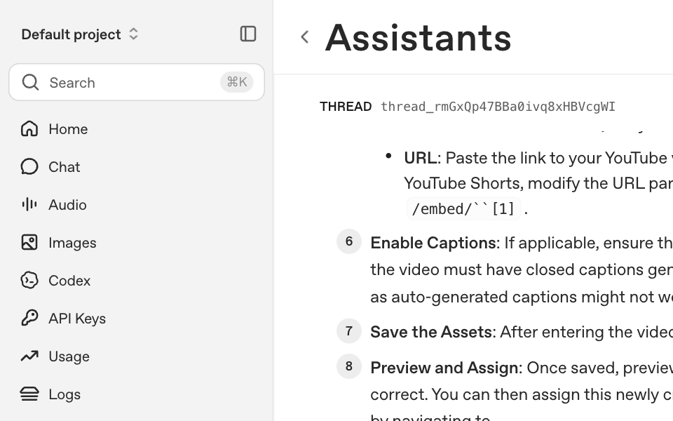

# OptiBot — Support-Doc RAG Pipeline (Node.js / TypeScript)

Scrapes OptiSigns support articles (Zendesk Help Center API), normalizes them to clean
Markdown, and uploads the **delta** to an OpenAI Vector Store via API. An OpenAI Assistant
("OptiBot") answers questions grounded in those docs with `Article URL:` citations.
Packaged as a Docker image that runs once and exits 0 — suitable for a daily job.

```
Zendesk API ─▶ scraper ─▶ clean Markdown ─▶ delta detector ─▶ OpenAI Files + Vector Store ─▶ OptiBot
                                                  ▲
                                          data/manifest.json (committed)
```

Stack: Node.js 20 + TypeScript (ESM), `openai`, `axios`, `cheerio`, `turndown`, `vitest`.
See [`docs/PLAN.md`](docs/PLAN.md) for full architecture and design notes.

## Setup

```bash
git clone <repo> && cd <repo>
npm install
cp .env.sample .env          # then fill in OPENAI_API_KEY etc.
```

## Run locally

```bash
npm run dev               # scrape + delta upload to the Vector Store (tsx src/main.ts)
npm run scrape            # scrape + write data/articles/*.md + manifest (no OpenAI)
npm run dry-run           # preview delta counts only (no OpenAI, no writes)
npm run create-assistant  # one-time: create the OptiBot Assistant
npm run verify-playground # headed browser: ask the sample question + screenshot
```

Quality gates:

```bash
npm test                  # vitest (unit + integration with mocked HTTP)
npm run lint              # eslint + prettier --check
npm run build             # tsc -> dist/
```

## Docker

```bash
docker build -t optibot .
docker run -e OPENAI_API_KEY=sk-... optibot               # runs once, exits 0
docker run -e OPENAI_API_KEY=sk-... optibot --scrape-only
```

## Chunking strategy

Static chunking: `max_chunk_size_tokens=800`, `chunk_overlap_tokens=400` (~50% overlap),
configurable via env. Support articles are short-to-medium with clear headings, so 800
tokens captures a whole section while the overlap preserves context across boundaries.
Each run logs files embedded and an estimated chunk count.

## Delta / incremental update

`data/manifest.json` maps each article id to its content hash + uploaded file id. Each run
classifies every article as **ADDED / UPDATED / SKIPPED** (SHA-256 of the rendered
Markdown) and uploads only ADDED + UPDATED. On UPDATE the old Vector Store file is deleted
and replaced (OpenAI files are immutable). The manifest is committed back to the repo so
the daily job has state across ephemeral containers.

Example log line (JSON):

```json
{
  "level": "INFO",
  "message": "pipeline complete",
  "added": 3,
  "updated": 1,
  "skipped": 398,
  "filesEmbedded": 4,
  "estimatedChunks": 17,
  "mode": "upload",
  "vector_store_id": "vs_..."
}
```

## Note: Assistants API vs Responses API

This project uses the OpenAI **Assistants API** because the take-home brief is written
around it (create an Assistant, attach it in the Playground, verbatim system prompt). The
Assistants API is **deprecated and scheduled for removal in August 2026**; OpenAI
recommends the **Responses API** (`client.responses.create` with the `file_search` tool).

The ingestion side here — Files API + **Vector Stores API** + the static chunking — is
**not** deprecated and is exactly what the Responses API consumes, so migrating later means
swapping only the query layer:

```ts
const resp = await client.responses.create({
  model: 'gpt-4o',
  instructions: SYSTEM_PROMPT,
  input: 'How do I add a YouTube video?',
  tools: [{ type: 'file_search', vector_store_ids: [VECTOR_STORE_ID] }],
});
console.log(resp.output_text);
```

## Daily job (DigitalOcean)

Deployed as a **DigitalOcean App Platform Scheduled Job** (cron `0 2 * * *`). It re-scrapes,
uploads only the delta, logs `added/updated/skipped` + chunk counts, and pushes the updated
manifest. Runtime logs: _<add the DO Scheduled Job logs link here>_.

## Playground screenshot

Sample question **"How do I add a YouTube video?"** answered with citations:



## Deliverables ↔ grading

| Area                         | Where                                                       |
| ---------------------------- | ----------------------------------------------------------- |
| Scrape & clean (25)          | `src/scraper/`, `data/articles/*.md`                        |
| API vector-store upload (20) | `src/store/openaiUploader.ts`, `scripts/createAssistant.ts` |
| Daily job & logs (15)        | `Dockerfile`, DO Scheduled Job, JSON logs                   |
| Code clarity + README (10)   | this file, `docs/PLAN.md`, tests, CI                        |
| Bonus (+5)                   | `vitest` suite + `--dry-run` smoke in CI                    |
